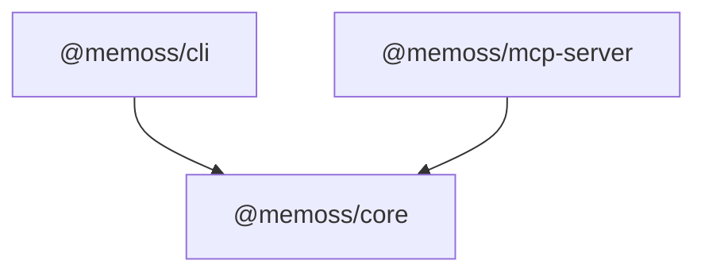

# Memoss — Phase 1 Technical Design

**Version:** 0.1  
**Date:** 2026-06-23  
**Status:** Draft for review  
**Companion docs:** [Product Design v0.2](product-design.md) · [Phase 1 Plan](phase-1-plan.md)

> 本文档在 `phase-1-plan.md` 里程碑之上，锁定 **Phase 1 可落地的架构边界、模块接口与技术栈选型**。产品语义以 `product-design.md` 为准；实现细节以本文档为准。

---

## 1. Scope & Principles

### 1.1 In scope (Phase 1)

| Phase | Engineering focus |
|-------|-------------------|
| **1a** | `@memoss/core` · `@memoss/cli` · `@memoss/mcp-server` · schema packs · graph viewer |
| **1b** | Web crawl runner · interactive ingest UX · provenance · lint health score · examples |

### 1.2 Design principles (engineering)

1. **Thin apps, fat core** — CLI 与 MCP 只做 I/O 编排；业务逻辑全部在 `@memoss/core`。
2. **File-system truth** — 不引入数据库；vault 即数据源。
3. **Portable CLI** — 单文件 bundle + Node 20+，无 native 二进制依赖（Phase 1 不绑定 `rg`）。
4. **Test the policies** — read-before-write、citation、draft branch 等信任原语必须有单元测试。
5. **Align with knowledge-catalog** — OKF 解析、web fetch、graph viewer 优先移植参考实现语义，而非重新发明。

### 1.3 Explicit non-goals (Phase 1)

- 向量检索 / hybrid search（Phase 2b `@memoss/search`）
- MaC sync / catalog-bridge（Phase 2a）
- Desktop / Web UI（Phase 2b）
- 多 vault workspace、云端存储
- Python SDK

---

## 2. Runtime & Toolchain

### 2.1 Locked decisions

| Item | Choice | Rationale |
|------|--------|-----------|
| **Language** | TypeScript 5.9+ | 与现有 Nx workspace 一致 |
| **Runtime** | Node.js **≥ 20 LTS** | 内置 `fetch`、稳定 `fs.promises`、长期支持 |
| **Package manager** | **pnpm** 9+ | workspace 已配置 `pnpm-lock.yaml`；节省磁盘、依赖隔离好 |
| **Monorepo** | Nx 23 | 已有 CI / caching / project graph |
| **Module format** | **ESM**（`"type": "module"`） | AI SDK、MCP SDK 均为 ESM-first；CLI 用 esbuild 打出可执行 bundle |
| **License** | Apache 2.0 | 与产品设计一致 |

### 2.2 CI alignment (M0 必做)

当前 `.github/workflows/ci.yml` 使用 `npm ci`，与 pnpm workspace 不一致。**M0 须改为：**

```yaml
- uses: pnpm/action-setup@v4
  with:
    version: 9
- uses: actions/setup-node@v4
  with:
    node-version: 22
    cache: pnpm
- run: pnpm install --frozen-lockfile
- run: pnpm nx run-many -t lint test build typecheck
```

Node CI 版本：**22 LTS**（与本地开发 Node 20+ 兼容；CI 用较新 LTS 提早暴露问题）。

### 2.3 Build strategy

| Project | Bundler | Output | Notes |
|---------|---------|--------|-------|
| `@memoss/core` | `tsc` (`@nx/js:tsc`) | `dist/` ESM + `.d.ts` | 可发布库；保持类型导出完整 |
| `@memoss/mcp-server` | `tsc` | `dist/` ESM + `.d.ts` | 薄包装层 |
| `@memoss/cli` | **esbuild** (`bundle: true`) | `dist/main.js` 单文件 | `bin.memoss` → `node dist/main.js`；便于 `npm i -g` |

**CLI esbuild 配置要点：**

- `platform: node`, `target: node20`, `format: esm`
- `banner` 注入 `createRequire` shim（若个别 CJS 依赖需要）
- Prompt 模板（`.md`）作为 `assets` 打入 bundle 或 `import.meta.url` 旁路读取

**不采用 tsup（Phase 1）** — Nx 已配置 esbuild + tsc；减少工具链种类。Phase 2 若发布多个 bin 再评估 tsup。

---

## 3. Repository Layout (target)

```
memoss/
├── apps/
│   └── cli/                         @memoss/cli
├── packages/
│   ├── core/                        @memoss/core
│   └── mcp/                         @memoss/mcp-server
├── schema-packs/
│   ├── personal/
│   └── research/
├── examples/                        Phase 1b
│   ├── research-topic/
│   └── ga4-ecommerce/
├── docs/
│   ├── product-design.md
│   ├── phase-1-plan.md
│   ├── phase-1-technical-design.md  ← 本文档
│   └── okf-spec.md                  M7
└── .github/workflows/ci.yml
```

### 3.1 Scaffold cleanup (M0)

移除 Nx 模板占位包，避免与真实架构混淆：

- 删除 `packages/{strings,colors,async,utils}`
- 更新 `eslint.config.mjs` 的 `depConstraints` 为 Memoss 边界规则（见 §4.2）
- 更新 `NX.md` 或删除（避免误导贡献者）

---

## 4. Package Architecture

### 4.1 Dependency graph



- `@memoss/core` **不依赖** 任何 `@memoss/*` 包
- 外部消费者（未来 Desktop）只引 `@memoss/core` + 自选 UI

### 4.2 Nx module boundary tags

| Project | Tags | May depend on |
|---------|------|---------------|
| `@memoss/core` | `scope:core`, `type:lib`, `publishable` | npm 依赖 only |
| `@memoss/mcp-server` | `scope:mcp`, `type:lib`, `publishable` | `scope:core` |
| `@memoss/cli` | `scope:cli`, `type:app` | `scope:core` |

```javascript
// eslint depConstraints (target)
{ sourceTag: 'scope:cli',  onlyDependOnLibsWithTags: ['scope:core'] },
{ sourceTag: 'scope:mcp',   onlyDependOnLibsWithTags: ['scope:core'] },
{ sourceTag: 'scope:core', onlyDependOnLibsWithTags: [] },
```

### 4.3 `@memoss/core` public API surface

```typescript
// packages/core/src/index.ts — intentional exports only

// OKF
export * from './okf/types.js';
export { parseOKF, serializeOKF } from './okf/document.js';
export { validateForRead, validateForWrite } from './okf/validator.js';

// Vault
export { loadVaultConfig, type VaultConfig } from './config/vault-config.js';
export { FsKnowledgeStore } from './adapters/fs-store.js';
export { SimpleGitAdapter } from './adapters/simple-git.js';

// Sources
export { createSourceAdapter } from './adapters/source-registry.js';

// Engine
export { runIngest, runQuery, runLint } from './engine/index.js';
export { createToolRegistry } from './tools/registry.js';

// Viewer
export { generateGraphHtml } from './viewer/generate.js';

// Errors
export { MemossError, ErrorCode } from './errors.js';
```

内部模块（`policies/`、`prompts/`）不导出，减少 API 冻结面。

---

## 5. Core Module Design

### 5.1 Directory structure

```
packages/core/src/
├── index.ts
├── errors.ts
├── config/
│   ├── vault-config.ts          # Zod schema + YAML load
│   └── vault-discovery.ts       # walk up for .memoss/config.yaml
├── okf/
│   ├── types.ts
│   ├── document.ts              # parse / serialize (custom, not gray-matter)
│   ├── validator.ts             # dual-mode
│   ├── index-builder.ts         # index.md generation
│   └── paths.ts                 # concept id ↔ path, link resolution
├── adapters/
│   ├── fs-store.ts
│   ├── simple-git.ts
│   ├── fetch.ts                 # HTTP + HTML→MD pipeline
│   ├── source-file.ts
│   ├── source-web.ts
│   ├── source-github.ts
│   └── source-registry.ts
├── tools/
│   ├── define-tool.ts           # Zod + AI SDK tool wrapper
│   ├── registry.ts
│   ├── page-tools.ts            # read/write/list/delete page
│   ├── index-tools.ts
│   ├── log-tools.ts
│   ├── search-tools.ts
│   ├── source-tools.ts
│   ├── fetch-tools.ts
│   └── git-tools.ts
├── policies/
│   ├── augment.ts
│   ├── citation.ts
│   └── reference-mint.ts        # Phase 1b
├── engine/
│   ├── model-registry.ts        # config string → LanguageModel
│   ├── orchestrator.ts          # generateText + maxSteps loop
│   ├── context.ts               # system prompt assembly
│   ├── ingest-runner.ts
│   ├── query-runner.ts
│   ├── lint-runner.ts
│   ├── web-crawl-runner.ts      # Phase 1b
│   └── prompts/                 # *.md templates
├── provenance/                  # Phase 1b
│   ├── manifest.ts
│   ├── hash.ts
│   └── registry.ts
└── viewer/
    ├── generate.ts              # port of reference_agent/viewer/generator.py
    └── assets/
        ├── viz.html
        ├── viz.js
        └── viz.css
```

### 5.2 OKF document layer

**选型：自研 frontmatter 解析 + `yaml` 包（不用 gray-matter）**

#### 为什么不用 gray-matter？

gray-matter 是优秀的通用 Markdown frontmatter 库，但 OKF 是 **Agent 高频读写的知识制品格式**，要求比「拆出 frontmatter + body」更严格。具体原因：

| 维度 | gray-matter 行为 | OKF / Memoss 需求 | 冲突 |
|------|------------------|-------------------|------|
| **无 frontmatter 的文档** | 静默返回 `{ data: {}, content: fullText }` | 第三方 bundle 可能无 `---`；Agent **写入**必须是合法 OKF 块 | 读/写语义需在解析层区分，不能靠 gray-matter 默认行为 |
| **未闭合的 `---`** | 行为不一致，可能整篇当 body | 必须抛出明确的 `OKFDocumentError`（与 k-c `document.py` 一致） | 错误语义不可控 |
| **序列化 round-trip** | 经 `js-yaml` 输出，key 顺序、引号、多行字符串风格与输入不同 | Agent augment 后 `git diff` 应 **尽量只显示内容变更**；未知 frontmatter key 必须原样保留 | 纯语义变更也会触发大量 frontmatter 格式 diff，干扰 `memoss approve` |
| **校验边界** | 库不负责校验 | 需要 `validateForRead`（仅 `type`）与 `validateForWrite`（`type`+`title`+`description`）两套模式 | 校验与解析耦合在同一模块更清晰 |
| **参考实现对齐** | — | knowledge-catalog `OKFDocument.parse/serialize` 是 **delimiter + PyYAML** 自定义实现 | 移植逻辑、对照测试更直接，而非再包一层 gray-matter |

**gray-matter 并非不能用**——若只做一次性导入，包一层也够用。Phase 1 选择自研解析，是因为 **parse → validate → merge → serialize** 是核心信任路径，diff 干净度与 k-c 行为一致性比少写 30 行代码更重要。

实现上仍是「`---` 分隔 + YAML」，只把分隔逻辑握在自己手里；YAML 词法/语法交给 `yaml`（eemeli）包，它在 round-trip 上比 gray-matter 内置的 `js-yaml` 更可控。

| 方案 | 结论 |
|------|------|
| `gray-matter` / `front-matter` | ❌ 见上表；OKF 写入路径的 round-trip 与错误语义不满足 |
| `remark` + `remark-frontmatter` | ❌ Phase 1 过重；OKF body 不需 AST 变换 |
| **自定义 delimiter 解析 + `yaml`** | ✅ 与 knowledge-catalog `document.py` 语义一致；round-trip 可控 |

```typescript
// 解析流程（与 k-c 对齐）
// 1. 有 frontmatter 时首行必须为 ---
// 2. 未闭合 --- → OKFDocumentError
// 3. yaml.parse frontmatter；非 mapping → error
// 4. body = 剩余行；serialize 时 sortKeys: false，保留 merge 后的 key 顺序
```

**双模式校验：**

| Mode | Required | Caller |
|------|----------|--------|
| `validateForRead` | `type` | 解析第三方 bundle |
| `validateForWrite` | `type`, `title`, `description` | `write_page` policy |

### 5.3 Vault config

**选型：`yaml` + Zod**

```typescript
// packages/core/src/config/vault-config.ts
import { z } from 'zod';

export const modelSpecSchema = z.object({
  provider: z.enum(['anthropic', 'openai']),
  model: z.string(),
  base_url: z.string().url().optional(),       // OpenAI-compatible 第三方端点
  api_key_env: z.string().optional(),          // 默认按 provider 推断
});

export const vaultConfigSchema = z.object({
  name: z.string(),
  description: z.string().default(''),
  mode: z.enum(['wiki', 'catalog', 'hybrid']).default('wiki'),
  okf_version: z.literal('0.1'),
  schema_pack: z.enum(['personal', 'research', 'data-catalog']).default('research'),
  agent: z.object({
    default_model: modelSpecSchema,
    lightweight_model: modelSpecSchema,
    max_steps: z.number().int().positive().default(50),
    temperature: z.number().min(0).max(2).default(0.3),
  }),
  git: z.object({
    enabled: z.boolean().default(true),
    auto_commit: z.boolean().default(true),
    draft_branch: z.boolean().default(true),
  }),
  search: z.object({
    strategy: z.enum(['auto', 'index', 'grep', 'hybrid']).default('auto'),
    hybrid_threshold_pages: z.number().int().default(200),
  }),
  provenance: z.object({
    enabled: z.boolean().default(false),
    track_source_hash: z.boolean().default(false),
  }),
});
```

`memoss init` 默认 `schema_pack: research`（可用 `--pack` 覆盖）；`loadVaultConfig(path)` 在每次操作前调用。

**`.memoss/config.yaml` 示例（模型段）：**

```yaml
schema_pack: research          # 默认；memoss init 不传 --pack 时使用

agent:
  default_model:               # Ingest / WebCrawl
    provider: anthropic        # anthropic | openai
    model: claude-sonnet-4-6
    # api_key_env: ANTHROPIC_API_KEY   # 可选；默认见下表
  lightweight_model:           # Query / Lint
    provider: anthropic
    model: claude-haiku-4-5
  max_steps: 50
  temperature: 0.3

# 第三方 OpenAI-compatible 示例（DeepSeek、Moonshot、本地 vLLM 等）：
# agent:
#   default_model:
#     provider: openai
#     model: deepseek-chat
#     base_url: https://api.deepseek.com/v1
#     api_key_env: DEEPSEEK_API_KEY
```

### 5.4 Knowledge store (`FsKnowledgeStore`)

```typescript
interface KnowledgeStore {
  readonly vaultRoot: string;

  readPage(relativePath: string): Promise<OKFDocument>;
  writePage(relativePath: string, doc: OKFDocument): Promise<void>;
  deletePage(relativePath: string): Promise<void>;
  listPages(dir?: string): Promise<string[]>;   // relative paths, excludes index.md/log.md
  readIndex(dir?: string): Promise<string | null>;
  writeIndex(dir: string, content: string): Promise<void>;
  readLog(): Promise<string>;
  appendLog(line: string, date?: string): Promise<void>;  // OKF date-grouped format
  exists(path: string): Promise<boolean>;
}
```

- 所有路径相对于 `vaultRoot`
- `writePage` **不**直接落盘 — 须经 `tools/write_page` + policies（见 §5.6）

### 5.5 Git adapter & draft workflow

**选型：`simple-git`**

```typescript
interface GitAdapter {
  isRepo(): Promise<boolean>;
  init(): Promise<void>;
  getCurrentBranch(): Promise<string>;
  createBranch(name: string): Promise<void>;
  checkout(branch: string): Promise<void>;
  merge(branch: string, options?: { ffOnly?: boolean }): Promise<void>;
  deleteBranch(name: string): Promise<void>;
  commit(message: string): Promise<string>;
  diff(ref?: string): Promise<string>;
  log(limit?: number): Promise<GitCommit[]>;
}
```

**Draft branch 命名规范：**

```
memoss/draft/<operation>-<YYYYMMDD-HHmmss>
// 例: memoss/draft/ingest-20260623-143022
```

**`memoss approve` 流程：**

1. 检测当前分支是否为 `memoss/draft/*`
2. `git checkout main`（或用户配置的 default branch）
3. `git merge --ff-only <draft-branch>`（失败则提示手动解决）
4. `git branch -d <draft-branch>`
5. 输出 merge summary

`git.enabled: false` 时：runner 直接写 working tree，跳过 branch/commit；`approve` 变为 no-op 并警告。

### 5.6 Tool layer & policies

**选型：Zod + Vercel AI SDK `tool()` helper**

```typescript
// define-tool.ts 模式
export function defineTool<T extends z.ZodType>(def: {
  name: string;
  description: string;
  parameters: T;
  execute: (args: z.infer<T>, ctx: ToolContext) => Promise<unknown>;
}): CoreTool;
```

`ToolContext` 注入：

```typescript
interface ToolContext {
  store: KnowledgeStore;
  git: GitAdapter;
  config: VaultConfig;
  policies: PolicyRunner;
  source?: SourceAdapter;
  draftMode: boolean;
}
```

**`write_page` 执行链（顺序固定）：**

```
1. policies.augment.assertReadFirst(path)
2. merge frontmatter（保留未知 key）
3. policies.augment.assertBodyNotShrunk(old, new)  // <30% → warning 写入 tool result
4. validateForWrite(frontmatter)
5. policies.citation.check(body)                    // Phase 1a: warn; 1b: error on ingest
6. store.writePage(path, doc)
```

### 5.7 Search (`search_kb`)

**Phase 1a 选型：纯 Node，不依赖 ripgrep 二进制**

```typescript
// search.strategy resolution
function resolveSearchStrategy(config: VaultConfig, pageCount: number) {
  if (config.search.strategy !== 'auto') return config.search.strategy;
  return pageCount <= config.search.hybrid_threshold_pages ? 'index' : 'grep';
}
```

**`grep` 实现：**

- `fast-glob` 枚举 `**/*.md`（排除 `index.md`, `log.md`）
- 大小写不敏感子串匹配 + 每文件命中行上下文（±1 行）
- 返回 `{ path, score, snippets[] }[]`，按命中次数排序

**Phase 1b 可选增强：** 检测系统 `rg` 可用时自动切换（`spawn('rg', ...)`），不作为硬依赖。

### 5.8 Source adapters

| Adapter | Phase | 技术选型 |
|---------|-------|----------|
| `source-file` | 1a | `fs` + 扩展名路由：`.md`/`.txt` 直读；`.pdf` → `pdf-parse` |
| `source-web` | 1a | 见 §6.1 |
| `source-github` | 1a | `@octokit/rest` + `GET /repos/{owner}/{repo}/git/trees/{branch}?recursive=1`；raw 内容用 `raw.githubusercontent.com` 或 API blob |

```typescript
interface SourceAdapter {
  readonly kind: 'file' | 'web' | 'github';
  readonly uri: string;
  listItems(): Promise<SourceItem[]>;
  readItem(id: string): Promise<SourceContent>;
}

interface SourceContent {
  id: string;
  title?: string;
  mime: string;
  text: string;           // markdown or plain text
  metadata?: Record<string, unknown>;
}
```

---

## 6. External Integrations

### 6.1 Web fetch (HTML → Markdown)

**选型：`linkedom` + `@mozilla/readability` + `turndown`**

| 方案 | 结论 |
|------|------|
| `markdownify` (HTML 直接转) | ❌ 噪声多（nav/footer）；k-c Python 版可接受因 prompt 过滤，TS 端应用 readability 提升质量 |
| Playwright 渲染 | ❌ Phase 1 过重、CI 成本高 |
| **Readability + Turndown** | ✅ 文章页质量高；配合 prompt 跳过低信号页 |

```typescript
// fetch.ts pipeline
// 1. fetch(url, { headers: { 'User-Agent': 'memoss/0.1 (+https://github.com/...)' } })
// 2. if content-type is text/markdown → return as-is
// 3. if text/html → Readability.parse → TurndownService.turndown
// 4. truncate to 40KB UTF-8（与 k-c fetcher 一致）
// 5. extract <a href> for Phase 1b crawl
```

### 6.2 PDF (Phase 1a minimal)

**选型：`pdf-parse`**

- 仅提取纯文本；不保留版面
- 大文件截断 40KB
- 扫描版 PDF 质量差 → tool 返回 warning，不阻塞 ingest

### 6.3 GitHub

**选型：`@octokit/rest`**

- 无 token：公开 repo，60 req/hr
- 有 `GITHUB_TOKEN`：5000 req/hr
- 过滤 `*.md` 文件；单文件上限 512KB

---

## 7. Agent Engine

### 7.1 Stack

| 组件 | 选型 |
|------|------|
| SDK | `ai` ^6 |
| Providers | `@ai-sdk/anthropic`, `@ai-sdk/openai` |
| Loop | `generateText({ maxSteps, tools })` |
| Tool schema | Zod → AI SDK `tool()` |

**Phase 1 不引入** `@ai-sdk/google` / LiteLLM；Gemini 支持留 Phase 2（与 k-c 默认模型对齐时再增）。

### 7.2 Model registry

**原则：显式 `provider`，禁止从模型名猜测路由。**

第三方模型（DeepSeek、Moonshot、Ollama OpenAI 兼容层等）大多走 **OpenAI-compatible HTTP API**；同一模型 ID（如 `gpt-4`）在不同厂商含义不同。配置必须同时指定 `provider` + `model`，可选 `base_url` 指向第三方端点。

```typescript
// model-registry.ts
import { createAnthropic } from '@ai-sdk/anthropic';
import { createOpenAI } from '@ai-sdk/openai';

const DEFAULT_KEY_ENV: Record<ModelProvider, string> = {
  anthropic: 'ANTHROPIC_API_KEY',
  openai: 'OPENAI_API_KEY',
};

export function resolveModel(spec: ModelSpec): LanguageModel {
  const apiKey = process.env[spec.api_key_env ?? DEFAULT_KEY_ENV[spec.provider]];
  if (!apiKey) {
    throw new MemossError('MISSING_API_KEY', `Set ${spec.api_key_env ?? DEFAULT_KEY_ENV[spec.provider]}`);
  }

  switch (spec.provider) {
    case 'anthropic':
      return createAnthropic({ apiKey })(spec.model);
    case 'openai':
      return createOpenAI({
        apiKey,
        baseURL: spec.base_url,   // undefined → 官方 OpenAI；有值 → 第三方兼容端点
      })(spec.model);
  }
}
```

| `provider` | AI SDK 工厂 | 典型场景 | 默认 `api_key_env` |
|------------|-------------|----------|-------------------|
| `anthropic` | `createAnthropic` | Claude 官方 API | `ANTHROPIC_API_KEY` |
| `openai` | `createOpenAI` | GPT 官方 API | `OPENAI_API_KEY` |
| `openai` + `base_url` | `createOpenAI({ baseURL })` | DeepSeek、Moonshot、Groq、本地 vLLM 等 | 用户自定义 `api_key_env` |

**Runner 取模型：**

| Runner | Config key |
|--------|------------|
| `ingest-runner`, `web-crawl-runner` | `agent.default_model` |
| `query-runner`, `lint-runner` | `agent.lightweight_model` |

**CLI 覆盖（可选）：**

```bash
memoss query "..." --model openai/gpt-4.1-mini
memoss ingest "..." --model openai/deepseek-chat --base-url https://api.deepseek.com/v1
```

`--model` 格式：`<provider>/<model>`；`--base-url` 仅对 `openai` provider 生效。覆盖只影响当次命令，不写回 config。

**Phase 1 不引入** `@ai-sdk/google`；Gemini 可在 Phase 2 以 `provider: google` 扩展。LiteLLM 不作为运行时依赖——AI SDK 的 `createOpenAI` + `base_url` 已覆盖主流第三方场景。

### 7.3 Orchestrator

```typescript
export async function runAgentLoop(opts: {
  model: LanguageModel;
  system: string;
  prompt: string;
  tools: Record<string, CoreTool>;
  maxSteps: number;
  temperature: number;
  onStepFinish?: (step: StepResult) => void;
}): Promise<AgentResult>;
```

- 每步记录 tool calls 供 CLI 打印进度（`consola` info 级别）
- 达到 `max_steps` 未终止 → 返回 `INCOMPLETE` 状态，不静默成功
- 用户中断（SIGINT）→ 若在 draft branch，提示 `memoss reject`

### 7.4 Runner 与 tool 子集

| Runner | Model tier | Tools |
|--------|------------|-------|
| `ingest-runner` | default | page, index, log, source, fetch, git |
| `query-runner` | lightweight | page, index, search, (+ write if --save) |
| `lint-runner` | lightweight | page, index, list, search, (+ write if --fix) |
| `web-crawl-runner` (1b) | default | ingest 集 + fetch_url（预算由 orchestrator 维护） |

Prompt 模板从 `engine/prompts/*.md` 加载，注入：

- `{{vault_name}}`, `{{schema_pack}}`, `{{instructions}}`（`.memoss/instructions.md` 内容）
- `{{date}}` ISO 格式

### 7.5 Testing AI paths

| 层级 | 策略 |
|------|------|
| Unit | policies、OKF、search、fetch pipeline — 全 mock，无 API key |
| Tool integration | `FsKnowledgeStore` + temp dir；mock `generateText` |
| E2E (optional, manual) | 标记 `@e2e`，CI 默认跳过；本地用 API key 跑 ingest 冒烟 |

---

## 8. CLI Design (`@memoss/cli`)

### 8.1 Stack

| 组件 | 选型 | 说明 |
|------|------|------|
| CLI framework | **`citty`** | 轻量、TS 原生、与 unjs 生态一致；子命令即对象树 |
| Output | **`consola`** | 分级日志；`--verbose` / `--quiet` |
| Prompts (1b) | **`@clack/prompts`** | interactive ingest 确认流 |
| Open browser | **`open`** | `memoss view` |
| Path | **`pathe`** | 跨平台路径 |

**不采用 oclif** — 生成代码多、与 Nx monorepo 集成成本高。

### 8.2 Command tree

```
memoss
├── init [path] [--pack personal|research]  # 默认 research
├── ingest <source> [--type auto|file|web|github] [--no-draft]
│   └── (1b) --crawl --seeds --max-pages --hosts --interactive
├── query <question> [--save] [--model <provider>/<model>] [--base-url]
├── lint [--fix] [--json]
├── approve
├── reject [--branch]
├── status [--json]
├── view [--no-open] [--output path]
└── serve [--vault path]   # stdio MCP; --port 留 Phase 2 HTTP transport
```

### 8.3 Vault discovery

```typescript
// 优先级
// 1. --vault / -C flag
// 2. MEMOSS_VAULT_PATH env
// 3. 从 cwd 向上查找 .memoss/config.yaml
// 4. 报错：未找到 vault
```

### 8.4 Exit codes

| Code | Meaning |
|------|---------|
| 0 | 成功 |
| 1 | 用户错误（参数、vault 无效） |
| 2 | 运行时错误（API、IO） |
| 3 | Agent 未完成（max steps） |
| 4 | Lint 发现 error 级问题 |

---

## 9. MCP Server (`@memoss/mcp-server`)

### 9.1 Stack

- `@modelcontextprotocol/sdk` **stdio transport**（默认）
- Phase 1 不实现 SSE/HTTP（`memoss serve --port` 在 plan 中标注为预留）

### 9.2 Tool exposure

| MCP tool name | Maps to |
|---------------|---------|
| `read_page` | core tool |
| `write_page` | core tool |
| `list_pages` | core tool |
| `search_kb` | core tool |
| `read_index` | core tool |
| `append_log` | core tool |
| `fetch_url` | core tool |
| `run_ingest` | `ingest-runner` |
| `run_query` | `query-runner` |
| `run_lint` | `lint-runner` |

MCP tool 的 `inputSchema` 直接由 Zod → JSON Schema 生成，与 CLI agent 共用 `defineTool`。

### 9.3 Server lifecycle

```typescript
// memoss serve
// 1. discover vault
// 2. load config
// 3. create ToolContext
// 4. StdioServerTransport + McpServer
// 5. block until stdin close
```

---

## 10. Graph Viewer

**策略：移植 knowledge-catalog `reference_agent/viewer/`**

| 组件 | 处理 |
|------|------|
| `generator.py` | → `packages/core/src/viewer/generate.ts` |
| `viz.html`, `viz.js`, `viz.css` | 复制到 `viewer/assets/`，构建时作为 static assets |
| 数据注入 | `window.BUNDLE = {...}` JSON 内联到 HTML（与 k-c 相同） |

`memoss view`：

1. `generateGraphHtml(vaultRoot)` → 写入 `.memoss/viz.html`（或 `--output`）
2. `open(fileUrl)` 打开默认浏览器

节点颜色：按 `type` 映射；palette 可通过 `schema_pack` 扩展。

---

## 11. Schema Packs

**策略：静态文件模板 + 最小 token 替换**

```
schema-packs/research/
├── .memoss/
│   ├── config.yaml          # 含 {{name}} {{description}}
│   └── instructions.md
├── index.md
├── log.md
├── topics/.gitkeep
├── references/.gitkeep
├── notes/.gitkeep
└── sources/.gitkeep
```

- **不用 Handlebars** — 仅替换 `{{name}}`、`{{description}}`、`{{date}}`
- `memoss init --pack research` → `fs.cp` + replace
- **默认 pack：`research`**（`memoss init` 不传 `--pack` 时）

---

## 12. Dependency Manifest

### 12.1 Production dependencies

| Package | Version | Used by | Purpose |
|---------|---------|---------|---------|
| `ai` | ^6.0.0 | core | Agent loop |
| `@ai-sdk/anthropic` | ^2.0.0 | core | Claude |
| `@ai-sdk/openai` | ^2.0.0 | core | GPT |
| `zod` | ^3.24.0 | core | Schemas |
| `yaml` | ^2.8.0 | core | YAML parse/serialize |
| `simple-git` | ^3.27.0 | core | Git operations |
| `fast-glob` | ^3.3.0 | core | File search |
| `linkedom` | ^0.18.0 | core | HTML parse |
| `@mozilla/readability` | ^0.6.0 | core | Article extraction |
| `turndown` | ^7.2.0 | core | HTML→MD |
| `pdf-parse` | ^1.1.1 | core | PDF text |
| `@octokit/rest` | ^21.0.0 | core | GitHub API |
| `citty` | ^0.1.6 | cli | CLI |
| `consola` | ^3.4.0 | cli | Logging |
| `open` | ^10.1.0 | cli | Open browser |
| `pathe` | ^2.0.0 | cli, core | Paths |
| `@clack/prompts` | ^0.9.0 | cli | Interactive (1b) |
| `@modelcontextprotocol/sdk` | ^1.12.0 | mcp | MCP server |

### 12.2 Dev dependencies (workspace root)

已有：`nx`, `vitest`, `typescript`, `eslint`, `@nx/*`

新增建议：

| Package | Purpose |
|---------|---------|
| `msw` | mock HTTP for fetch tests |
| `@types/turndown` | types |

### 12.3 Explicitly not added (Phase 1)

| Package | Reason deferred |
|---------|-----------------|
| `gray-matter` | 自定义 OKF 解析 |
| `commander` / `yargs` | citty 足够 |
| `ripgrep` / `vscode-ripgrep` | 避免 native 依赖 |
| `playwright` | Web 渲染过重 |
| `better-sqlite3` | 文件系统即数据库 |
| `chromadb` / `openai` embeddings | Phase 2b search |

---

## 13. Testing Strategy

```
packages/core/
├── src/**/*.spec.ts          # unit, co-located
└── test/
    ├── fixtures/             # minimal vaults, sample OKF
    └── integration/          # store + git + tools

apps/cli/
└── src/**/*.spec.ts          # command parsing, vault discovery

packages/mcp/
└── src/**/*.spec.ts          # tool listing, schema shape
```

**Fixtures：**

- `test/fixtures/vault-minimal/` — 3 pages, index, log
- `test/fixtures/kc-sample/` — 从 knowledge-catalog 复制的只读 bundle 片段（OKF Conformance）

**Coverage 目标（Phase 1a 结束）：**

- `okf/`, `policies/`, `tools/` ≥ 85%
- `engine/` ≥ 60%（AI 路径 mock 为主）
- CLI command routing ≥ 70%

---

## 14. Security & Trust

| Topic | Phase 1 handling |
|-------|------------------|
| API keys | 仅环境变量；永不写入 vault 或 log |
| `fetch_url` | 仅 `http:`/`https:`；禁止 `file:` redirect |
| Path traversal | `write_page` 规范化路径，拒绝 `..` 逃逸 vault root |
| GitHub token | 可选；通过 `GITHUB_TOKEN` env |
| Draft branch | 默认开启；`--no-draft` 需显式 flag + 警告 |

---

## 15. Resolved vs Open Decisions

### 15.1 Resolved in this document

| # | Decision |
|---|----------|
| 1 | pnpm + Node 20+ + ESM |
| 2 | core/mcp 用 tsc；cli 用 esbuild bundle |
| 3 | 自定义 OKF 解析 + `yaml`（不用 gray-matter，见 §5.2） |
| 4 | Web: Readability + Turndown |
| 5 | Search: Node grep；不绑定 rg |
| 6 | CLI: citty + consola |
| 7 | AI SDK generateText + maxSteps |
| 8 | 移除模板占位 packages |
| 9 | CI 改 pnpm |
| 10 | **默认 schema pack：`research`** |
| 11 | **模型配置显式 `provider` + `model`；`openai` + `base_url` 支持第三方** |

### 15.2 Open — needs product input

| # | Question | Options | Recommendation |
|---|----------|---------|----------------|
| O1 | **ingest 默认是否走 draft** | 总是 draft vs `--no-draft` 可选 | 总是 draft（`git.enabled: false` 除外） |
| O2 | **交互式 ingest 放 1a 还是 1b** | 计划写 1b | 保持 1b；1a 用非交互 |
| O3 | **npm 包名** | `memoss` vs `@memoss/cli` 全局 bin | 发布 `memoss` bin；scope 包 `@memoss/cli` |

---

## 16. Milestone Mapping (engineering tasks)

本文档章节 → `phase-1-plan.md` 里程碑：

| Milestone | This doc sections |
|-----------|-------------------|
| M0 | §2, §3.1, §4.2, §12 |
| M1 | §5.2 |
| M2 | §5.4, §5.5, §5.8, §6 |
| M3 | §5.6, §5.7 |
| M4 | §7 |
| M5 | §8 |
| M6 | §9 |
| M7 | §10, §11 |
| M8 | §5.1 web-crawl, §8.1 @clack/prompts |
| M9 | §5.1 provenance |

---

## 17. References

- [knowledge-catalog `document.py`](https://github.com/GoogleCloudPlatform/knowledge-catalog/blob/main/okf/src/reference_agent/bundle/document.py)
- [knowledge-catalog `fetcher.py`](https://github.com/GoogleCloudPlatform/knowledge-catalog/blob/main/okf/src/reference_agent/web/fetcher.py)
- [knowledge-catalog `viewer/generator.py`](https://github.com/GoogleCloudPlatform/knowledge-catalog/blob/main/okf/src/reference_agent/viewer/generator.py)
- [Vercel AI SDK — Tool Calling](https://sdk.vercel.ai/docs/ai-sdk-core/tools-and-tool-calling)
- [MCP TypeScript SDK](https://github.com/modelcontextprotocol/typescript-sdk)
